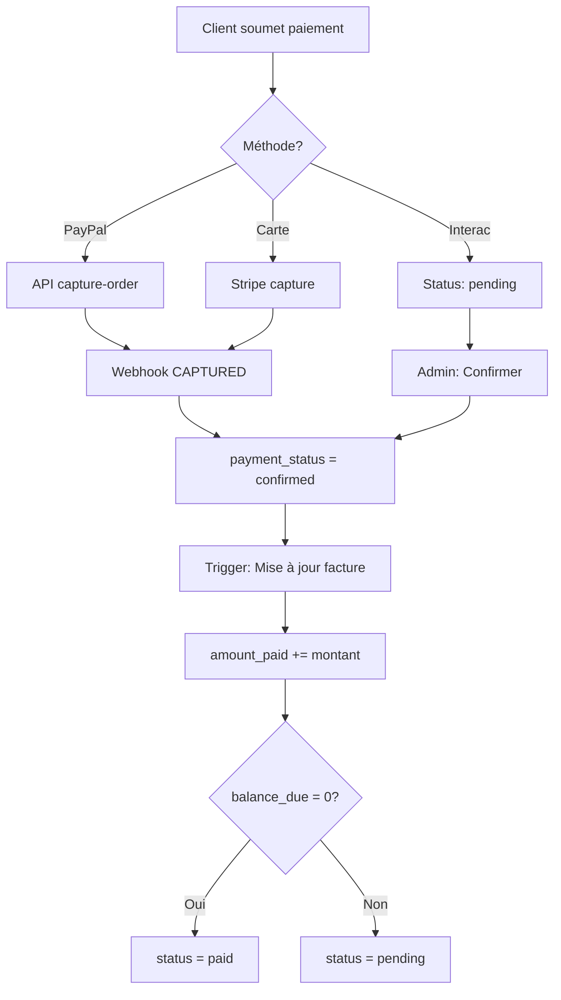
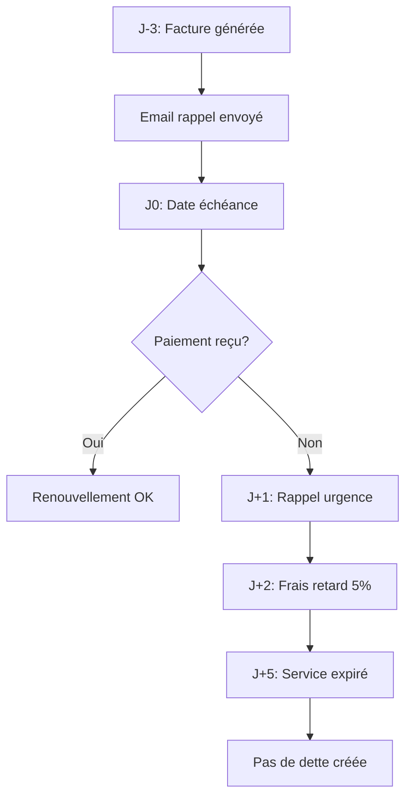
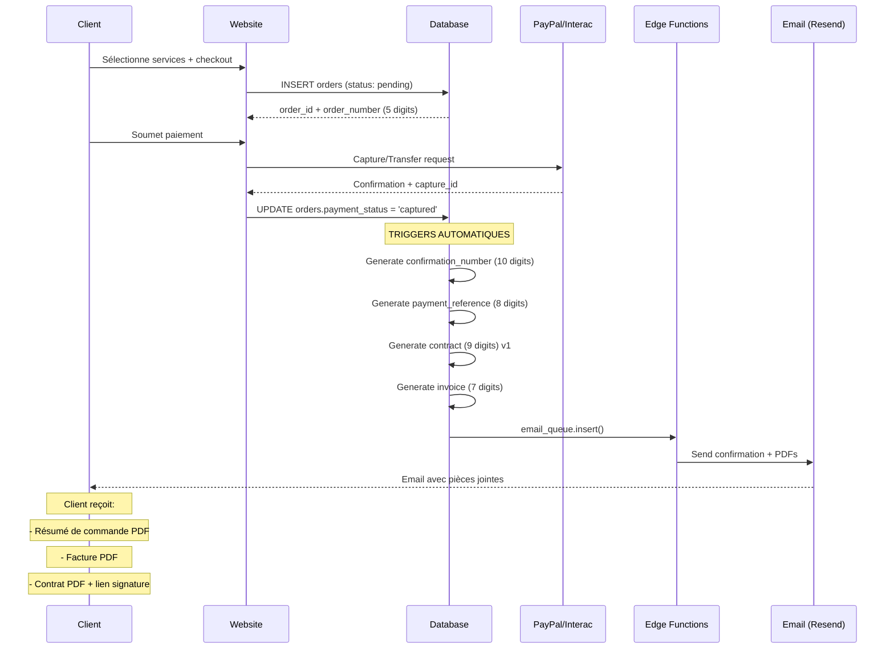

# 📑 DOCUMENTATION FONCTIONNELLE COMPLÈTE — SYSTÈME NIVRA TELECOM

**Version :** 2026.02.06 (V2.4)  
**Statut :** Opérationnel / Standards Télécom Québec  
**Confidentialité :** Interne Nivra Telecom Inc.  
**Dernière mise à jour :** 7 février 2026

---

## TABLE DES MATIÈRES

1. [Portail Client — Fonctionnement Détaillé](#1%EF%B8%8F⃣-portail-client--fonctionnement-détaillé)
2. [Portail Admin — Fonctionnement Complet](#2%EF%B8%8F⃣-portail-admin--fonctionnement-complet)
3. [Employés / Support — Rôles et Droits](#3%EF%B8%8F⃣-employés--support--rôles-et-droits)
4. [Communications Système](#4%EF%B8%8F⃣-communications-système)
5. [Traitement d'une Commande — Flux End-to-End](#5%EF%B8%8F⃣-traitement-dune-commande--flux-end-to-end)
6. [Structure des Numéros (Règle V2.4)](#6%EF%B8%8F⃣-structure-des-numéros-règle-v24)
7. [Source de Vérité & Règles Métier](#7%EF%B8%8F⃣-source-de-vérité--règles-métier)
8. [Références Techniques](#8%EF%B8%8F⃣-références-techniques)

---

## 1️⃣ PORTAIL CLIENT — FONCTIONNEMENT DÉTAILLÉ

Le portail client (`/portal`) est l'interface centrale permettant aux abonnés de gérer leur cycle de vie chez Nivra Telecom.

### 🔹 Création de Compte Client

#### Processus de création
| Étape | Description | Source de données |
|-------|-------------|-------------------|
| 1. Inscription | Client remplit le formulaire avec courriel/mot de passe | `ClientSignupForm.tsx` |
| 2. Vérification | Email de validation envoyé (OTP 6 chiffres) | `email_queue` → Resend |
| 3. Profil | Création entrée dans `profiles` | Trigger SQL |
| 4. Numéro de compte | **Génération automatique 6 chiffres (2–9)** | `trg_set_profile_account_number` |

#### Génération du Numéro de Compte
```sql
-- Trigger automatique sur INSERT dans profiles
CREATE TRIGGER trg_set_profile_account_number
BEFORE INSERT ON profiles
FOR EACH ROW
EXECUTE FUNCTION set_secure_account_number();

-- Fonction de génération (6 chiffres, premier = 2-9)
SELECT (floor(random() * 8) + 2)::text || 
       lpad(floor(random() * 100000)::text, 5, '0');
-- Exemple: 234567, 891234, 567890
```

#### Hiérarchie des données client
```
PROFILE (user_id, account_number)
├── ORDERS (commandes passées)
│   ├── BILLING_INVOICES (factures liées)
│   └── CONTRACTS (contrats générés)
├── SUBSCRIPTIONS (services actifs)
├── BILLING_PAYMENTS (paiements effectués)
└── TICKETS (demandes support)
```

---

### 🔹 Tableau de Bord Client

**Route :** `/portal`  
**Fichier :** `src/pages/client/ClientDashboard.tsx`

#### Ce que le client voit exactement

| Section | Données affichées | Source |
|---------|-------------------|--------|
| **Solde actuel** | Montant dû calculé dynamiquement | `billing_invoices.balance_due` |
| **Expiration service** | Compte à rebours J-X | `subscriptions.current_period_end` |
| **Statut services** | Internet ✅ / TV 🔄 / Mobile ❌ | `subscriptions.status` |
| **Dernière facture** | Montant + Date + Statut | `billing_invoices` ORDER BY |
| **Actions rapides** | Payer / Ticket / Rendez-vous | Liens directs |

#### Différences clés entre entités

| Entité | Définition | Table source | Statuts possibles |
|--------|------------|--------------|-------------------|
| **Commande** | Intention d'achat soumise | `orders` | pending, captured, active, cancelled |
| **Service actif** | Abonnement provisionné | `subscriptions` | active, paused, expired, cancelled |
| **Facture** | Document légal émis | `billing_invoices` | pending, paid, overdue, cancelled |
| **Paiement** | Transaction confirmée | `billing_payments` | pending, confirmed, failed, refunded |
| **Contrat** | Document légal signé | `contracts` | draft, sent, signed, void, superseded |

---

### 🔹 Section Facturation

**Route :** `/portal/invoices`  
**Fichier :** `src/pages/client/ClientInvoices.tsx`

#### Affichage Header (Style Rogers/Telus)

```
┌─────────────────────────────────────────────────────────┐
│  FACTURATION                                             │
│  ───────────────────────────────────────────────────────│
│  Numéro de compte : 234567          [📋 Copier]         │
│  Crédit disponible : 0,00 $                              │
│  Statut du compte : ● Actif                              │
│  Solde à payer : 126,45 $                                │
└─────────────────────────────────────────────────────────┘
```

#### Détails de la section

| Champ | Description | Source DB |
|-------|-------------|-----------|
| **Numéro de compte** | 6 chiffres (2–9), identifiant unique | `profiles.account_number` |
| **Numéro de facture** | 7 chiffres (2–9), par facture | `billing_invoices.invoice_number` |
| **Cycle mensuel** | Jour du mois (1-28) | `billing_invoices.bill_cycle_date` |
| **Période** | Date début → Date fin | `cycle_start` / `cycle_end` |
| **Solde** | Total - Montant payé | Calculé: `total + fees - amount_paid` |

#### Facture Mensuelle vs Facture Unique

| Type | Déclencheur | Contenu | Template |
|------|-------------|---------|----------|
| **Mensuelle** | Cron J-3 avant cycle | Services récurrents (Internet, TV, Mobile) | `invoiceMonthlyTemplateV2.ts` |
| **Unique** | Checkout équipement | Équipements, frais activation, livraison | `invoiceOneTimeTemplateV2.ts` |

#### Calcul des montants

```typescript
// Structure billing_totals (snapshot immutable)
interface BillingTotals {
  subtotal: number;           // Sous-total brut
  discount_amount: number;    // Rabais appliqué
  base_amount: number;        // Montant taxable
  tps_amount: number;         // TPS 5%
  tvq_amount: number;         // TVQ 9.975%
  total: number;              // Total final
  promo_code?: string;        // Code promo utilisé
}

// Calcul solde dynamique
balance_due = total + fees - amount_paid;
// Si balance_due ≤ 0 → status = 'paid'
```

---

### 🔹 Paiements

**Route :** `/portal/payments`  
**Fichier :** `src/pages/client/ClientPayments.tsx`

#### Méthodes supportées

| Méthode | Type | Confirmation | Délai |
|---------|------|--------------|-------|
| **PayPal** | Automatique | Webhook instant | < 5 sec |
| **Interac e-Transfer** | Manuel | Admin confirme | 1-24h |
| **Carte de crédit** | Automatique | Capture instant | < 5 sec |

#### Quand un paiement est considéré "Confirmé"



#### Différence entre identifiants de paiement

| Identifiant | Longueur | Usage | Exemple | Stockage |
|-------------|----------|-------|---------|----------|
| `payment_reference` | 8 chiffres | Référence interne Nivra (PDFs) | `81143403` | `orders.payment_reference` |
| `confirmation_number` | 10 chiffres | Reçu client (email/PDF) | `2195393431` | `orders.confirmation_number` |
| `provider_payment_id` | Variable | ID technique externe | `7ABC123XYZ` | `billing_payments.provider_payment_id` |

#### Ce que le client reçoit après paiement

| Document | Format | Envoi | Contenu |
|----------|--------|-------|---------|
| **Email confirmation** | HTML | Immédiat | Résumé + Liens |
| **Résumé de commande** | PDF | Pièce jointe | Détails achat |
| **Facture** | PDF | Pièce jointe | Montants officiels |
| **Contrat** | PDF | Pièce jointe | Conditions de service |

---

### 🔹 Contrats

**Route :** `/portal/contracts`  
**Fichier :** `src/pages/client/ClientContracts.tsx`

#### Génération automatique

```sql
-- Trigger sur orders quand payment_status change
CREATE TRIGGER trg_auto_generate_contract_on_payment
AFTER UPDATE ON orders
FOR EACH ROW
WHEN (
  OLD.payment_status IS DISTINCT FROM NEW.payment_status AND
  NEW.payment_status IN ('captured', 'paid', 'confirmed') AND
  OLD.payment_status NOT IN ('captured', 'paid', 'confirmed')
)
EXECUTE FUNCTION auto_generate_contract_on_payment();
```

#### Cycle de vie du contrat

```
DRAFT → SENT → SIGNED
         ↓
       VOID (annulation)
         ↓
    SUPERSEDED (nouvelle version)
```

| Statut | Description | Trigger |
|--------|-------------|---------|
| `draft` | Généré, non envoyé | Création automatique |
| `sent` | Envoyé au client | Email + lien signature |
| `signed` | Signé électroniquement | `signed_at` rempli |
| `void` | Annulé manuellement | Action admin |
| `superseded` | Remplacé par nouvelle version | Modification commande |

#### Historique et versions

```sql
-- Quand une commande est modifiée (plan/service/adresse)
SELECT supersede_contract_version(order_id);
-- 1. Marque contrat actuel comme 'superseded'
-- 2. Crée nouvelle version (v2, v3...)
-- 3. Notifie client pour re-signature
```

---

## 2️⃣ PORTAIL ADMIN — FONCTIONNEMENT COMPLET

Le portail admin (`/admin`) permet la gestion globale de l'entreprise télécom.

### 🔹 Admin Orders (Commandes)

**Route :** `/admin/orders`  
**Fichier :** `src/pages/admin/AdminOrders.tsx`

#### Visibilité immédiate (sans cliquer)

| Colonne | Source | Description |
|---------|--------|-------------|
| **Client** | `profiles.full_name` | Nom complet |
| **Email** | `profiles.email` | Courriel |
| **Total** | `snapshot_total` | Montant TTC |
| **Statut paiement** | `orders.payment_status` | pending/captured/paid |
| **Date** | `orders.created_at` | Date de commande |

#### Lien commande → client

```sql
SELECT o.*, p.full_name, p.email, p.account_number
FROM orders o
LEFT JOIN profiles p ON o.user_id = p.id
WHERE o.id = :order_id;
```

#### Statuts exacts et signification

| Statut | Description | Action suivante |
|--------|-------------|-----------------|
| `pending` | Commande créée, en attente paiement | Attendre capture |
| `captured` | PayPal capturé avec succès | → active |
| `paid` | Paiement confirmé (Interac/autre) | → active |
| `confirmed` | Alias de paid | → active |
| `active` | Service provisionné | Maintenance |
| `completed` | Installation terminée | Cycle facturation |
| `cancelled` | Annulée par client/admin | Fin de vie |

#### Source de vérité des montants

```typescript
// Priorité de lecture des montants
const snapshotTotal = 
  order.equipment_details?.billing_totals?.total ??  // 1. Snapshot JSON
  order.total ??                                      // 2. Colonne total
  0;                                                  // 3. Fallback

// JAMAIS recalculer depuis les items (risque d'écart)
```

---

### 🔹 Admin Payments

**Route :** `/admin/payments`  
**Fichier :** `src/pages/admin/AdminPayments.tsx`

#### Colonnes critiques

| Colonne | Source DB | Description |
|---------|-----------|-------------|
| **Payé** | `billing_payments.amount` | Montant RÉEL capturé par le provider |
| **Facture** | `billing_invoices.total` | Montant ATTENDU selon snapshot |
| **Écart** | Calculé | Payé - Facture (pour réconciliation) |

#### Mapping source → colonne

```typescript
// Colonne "Payé" - toujours depuis le provider
const paidAmount = payment.amount; // billing_payments.amount

// Colonne "Facture" - depuis le snapshot
const invoiceTotal = invoice.total; // billing_invoices.total

// Écart (pour litiges)
const discrepancy = paidAmount - invoiceTotal;
```

#### Gestion litiges / rétrofacturations

| Type | Action | Statut résultant |
|------|--------|------------------|
| **Rétrofacturation PayPal** | Webhook DISPUTE | `disputed` |
| **Annulation Interac** | Admin manuel | `reversed` |
| **Remboursement** | Admin → Refund | `refunded` |

#### Différences Interac vs PayPal

| Aspect | PayPal | Interac |
|--------|--------|---------|
| Confirmation | Automatique (webhook) | Manuelle (admin) |
| ID technique | `capture_id` | Référence bancaire |
| Délai | Instant | 1-24h |
| Litiges | Via résolution PayPal | Direct avec banque |

---

### 🔹 Admin Facturation

**Route :** `/admin/billing`  
**Fichier :** `src/pages/admin/AdminBilling.tsx`

#### Génération automatique factures mensuelles

```sql
-- Cron job: billing-generate-renewals-hourly
-- Déclenché: Chaque heure à minuit (Montréal)
-- Condition: J-3 avant fin de cycle

SELECT generate_renewal_invoices();
-- Pour chaque abonnement actif où current_period_end - 3 days = today()
-- Créer billing_invoice avec:
--   - invoice_number (7 chiffres, 2-9)
--   - cycle_start/end
--   - total = prix mensuel + taxes
--   - status = 'pending'
```

#### Factures One-Time

| Déclencheur | Contenu | Génération |
|-------------|---------|------------|
| Checkout équipement | Router, décodeur, SIM | Immédiate |
| Frais activation | Installation, livraison | Immédiate |
| Frais manuels | Remplacement, intervention | Admin |

#### Numérotation opérateur (Règle 2–9)

```sql
-- Génération sécurisée (jamais 0 ou 1 en premier)
SELECT generate_secure_numeric_id(7);
-- Résultat: 2345678, 8765432, 9123456...
```

#### Règles de non-renouvellement



---

### 🔹 Admin Contrats

**Route :** `/admin/contracts`  
**Fichier :** `src/pages/admin/AdminContracts.tsx`

#### Génération automatique

| Événement | Action | Résultat |
|-----------|--------|----------|
| Paiement capturé | Trigger SQL | Contrat v1 créé |
| Modification plan | `supersede_contract_version()` | v2 créé, v1 superseded |
| Annulation | Admin action | Contrat void |

#### Versioning détaillé

```sql
-- Table contracts
id UUID PRIMARY KEY,
contract_number TEXT,      -- 9 chiffres (2-9)
order_id UUID,             -- Lien commande
version INTEGER DEFAULT 1, -- v1, v2, v3...
status TEXT,               -- draft/sent/signed/void/superseded
signed_at TIMESTAMP,       -- Date signature
created_at TIMESTAMP
```

#### Workflow modification de commande

```
1. Admin modifie le plan/service
2. Système détecte changement critique
3. Appel: supersede_contract_version(order_id)
4. Ancien contrat → status = 'superseded'
5. Nouveau contrat → version = old_version + 1, status = 'draft'
6. Email envoyé au client avec nouveau lien signature
```

---

## 3️⃣ EMPLOYÉS / SUPPORT — RÔLES ET DROITS

Le système utilise une table dédiée `user_roles` avec Row Level Security (RLS).

### Types d'employés

| Rôle | Code | Accès principal |
|------|------|-----------------|
| **Administrateur** | `admin` | `/admin` - Accès total |
| **Employé Support** | `employee` | `/staff` - Clients, tickets, facturation (lecture) |
| **Technicien** | `technician` | `/staff` - Rendez-vous, POS terrain |
| **Commercial** | `sales` | Leads, commissions, devis |

### Matrice des droits

| Fonctionnalité | Admin | Employee | Technician | Sales |
|----------------|-------|----------|------------|-------|
| **Voir clients** | ✅ | ✅ | ❌ | ✅ |
| **Modifier clients** | ✅ | ✅ (limité) | ❌ | ❌ |
| **Voir paiements** | ✅ | ✅ | ❌ | ❌ |
| **Confirmer paiements** | ✅ | ❌ | ❌ | ❌ |
| **Voir contrats** | ✅ | ✅ | ❌ | ❌ |
| **Annuler contrats** | ✅ | ❌ | ❌ | ❌ |
| **Gestion employés** | ✅ | ❌ | ❌ | ❌ |
| **Logs d'audit** | ✅ | ❌ | ❌ | ❌ |

### Accès aux données

```sql
-- Fonction de vérification de rôle
CREATE FUNCTION has_role(_user_id uuid, _role app_role)
RETURNS boolean AS $$
  SELECT EXISTS (
    SELECT 1 FROM user_roles
    WHERE user_id = _user_id AND role = _role
  )
$$ LANGUAGE sql SECURITY DEFINER;

-- Politique RLS exemple
CREATE POLICY "Employees can view clients"
ON profiles FOR SELECT
USING (
  auth.uid() = id OR                    -- Propre profil
  has_role(auth.uid(), 'employee') OR   -- Employé
  has_role(auth.uid(), 'admin')         -- Admin
);
```

### Journalisation (Audit Logs)

| Champ | Description |
|-------|-------------|
| `action` | Type d'action (view, create, update, delete) |
| `table_name` | Table affectée |
| `record_id` | ID de l'enregistrement |
| `user_id` | Employé ayant effectué l'action |
| `created_by_role` | Rôle au moment de l'action |
| `ip_address` | Adresse IP |
| `timestamp` | Date/heure précise |

---

## 4️⃣ COMMUNICATIONS SYSTÈME

### 🔹 Emails Automatiques

Tous les emails passent par la file `email_queue`, traitée par `process-email-queue`.

| Événement | Template | Pièces jointes |
|-----------|----------|----------------|
| **Création compte** | `welcome_email` | — |
| **Confirmation commande** | `order_confirmation` | Résumé PDF |
| **Paiement confirmé** | `payment_received` | Reçu PDF |
| **Facture générée** | `invoice_ready` | Facture PDF |
| **Rappel paiement J-3** | `payment_reminder` | — |
| **Suspension J+2** | `service_warning` | — |
| **Annulation** | `service_cancelled` | — |
| **Contrat à signer** | `contract_signature` | Contrat PDF + lien |

### 🔹 PDFs Générés

#### Facture Mensuelle V2

| Champ PDF | Source données |
|-----------|----------------|
| `{{account_number}}` | `profiles.account_number` |
| `{{invoice_number}}` | `billing_invoices.invoice_number` |
| `{{invoice_date}}` | `billing_invoices.created_at` |
| `{{cycle_start}}` | `billing_invoices.cycle_start` |
| `{{cycle_end}}` | `billing_invoices.cycle_end` |
| `{{invoice_lines}}` | Services récurrents du mois |
| `{{subtotal}}` | Somme des lignes |
| `{{tax_gst}}` | 5% sur subtotal |
| `{{tax_qst}}` | 9.975% sur subtotal |
| `{{total_due}}` | Grand total TTC |

**Template :** `src/lib/pdf/invoiceMonthlyTemplateV2.ts`

#### Facture Unique V2

| Champ PDF | Source données |
|-----------|----------------|
| `{{items}}` | Équipements + frais |
| `{{qty}}` | Quantité par item |
| `{{unit_price}}` | Prix unitaire |
| `{{line_total}}` | Prix × Quantité |
| `{{order_number}}` | `orders.order_number` |

**Template :** `src/lib/pdf/invoiceOneTimeTemplateV2.ts`

#### Contrat de Service

| Section | Contenu |
|---------|---------|
| **Page 1** | Résumé exécutif |
| **Page 2-3** | Détails des services souscrits |
| **Annexe A** | Conditions générales |
| **Annexe B** | Politique de confidentialité |
| **Annexe C** | Modalités d'installation |
| **Annexe D** | Modalités de paiement |
| **Annexe E** | Support et plaintes |

**Template :** `src/lib/pdf/contractTemplate.ts`

---

## 5️⃣ TRAITEMENT D'UNE COMMANDE — FLUX END-TO-END

### Diagramme chronologique



### Liste chronologique détaillée

| Étape | Action | Résultat | Données générées |
|-------|--------|----------|------------------|
| **1** | Client sélectionne services | Panier créé | `cart_items` |
| **2** | Checkout validé | Snapshot billing_totals | `equipment_details` JSON |
| **3** | INSERT orders | Commande créée | `order_number` (5 digits) |
| **4** | Paiement soumis | Attente capture | `payment_status: pending` |
| **5** | PayPal/Interac OK | Capture confirmée | `provider_payment_id` |
| **6** | UPDATE payment_status | Trigger déclenché | — |
| **7** | Génération confirmation | Reçu client | `confirmation_number` (10) |
| **8** | Génération référence | Suivi interne | `payment_reference` (8) |
| **9** | Génération contrat | Document légal | `contract_number` (9) v1 |
| **10** | Génération facture | Document comptable | `invoice_number` (7) |
| **11** | Email queue | Préparation envoi | `email_queue` entry |
| **12** | process-email-queue | PDFs générés + envoyés | 3 pièces jointes |
| **13** | Admin: activation | Service provisionné | `subscriptions` entry |
| **14** | Cycle J0 | Facturation mensuelle | `bill_cycle_date` set |

---

## 6️⃣ STRUCTURE DES NUMÉROS (RÈGLE V2.4)

### Règle globale obligatoire

> **Tous les identifiants visibles dans les PDFs et portails sont 100% numériques et ne commencent JAMAIS par 0 ou 1.**

### Tableau récapitulatif

| Type | Longueur | Format | Exemple | Table.Colonne | Quand créé |
|------|----------|--------|---------|---------------|------------|
| **Numéro de compte** | 6 chiffres | `[2-9]xxxxx` | `234567` | `profiles.account_number` | Création profil |
| **Numéro de commande** | 5 chiffres | `[2-9]xxxx` | `74966` | `orders.order_number` | Checkout |
| **Numéro de facture** | 7 chiffres | `[2-9]xxxxxx` | `3916061` | `billing_invoices.invoice_number` | Paiement confirmé |
| **Référence paiement** | 8 chiffres | `[2-9]xxxxxxx` | `81143403` | `orders.payment_reference` | Paiement confirmé |
| **Confirmation (reçu)** | 10 chiffres | `[2-9]xxxxxxxxx` | `2195393431` | `orders.confirmation_number` | Paiement confirmé |
| **Numéro de contrat** | 9 chiffres | `[2-9]xxxxxxxx` | `200885783` | `contracts.contract_number` | Paiement confirmé |

### Logique de génération

```typescript
// Frontend: src/lib/secureIdGenerator.ts
function generateSecureNumber(length: number): string {
  const firstDigit = Math.floor(Math.random() * 8) + 2; // 2-9
  const remaining = Array.from({ length: length - 1 }, () => 
    Math.floor(Math.random() * 10)
  ).join('');
  return `${firstDigit}${remaining}`;
}

// Backend: SQL function
CREATE FUNCTION generate_secure_numeric_id(length int)
RETURNS text AS $$
  SELECT (floor(random() * 8) + 2)::text || 
         lpad(floor(random() * power(10, length - 1))::text, length - 1, '0');
$$ LANGUAGE sql;
```

### Où chaque numéro apparaît

| Numéro | Portail Client | Portail Admin | PDF Facture | PDF Contrat | Email |
|--------|----------------|---------------|-------------|-------------|-------|
| Compte | ✅ Header | ✅ Liste clients | ✅ | ✅ | ✅ |
| Commande | ✅ Historique | ✅ Liste commandes | ✅ | ✅ | ✅ |
| Facture | ✅ Facturation | ✅ Liste factures | ✅ (header) | ❌ | ✅ |
| Référence | ✅ Reçu | ✅ Paiements | ✅ | ❌ | ✅ |
| Confirmation | ✅ Reçu | ✅ Commande | ✅ | ❌ | ✅ |
| Contrat | ✅ Documents | ✅ Contrats | ❌ | ✅ (header) | ✅ |

---

## 7️⃣ SOURCE DE VÉRITÉ & RÈGLES MÉTIER

### Sources de vérité par domaine

| Domaine | Table source | Colonne(s) clé(s) |
|---------|--------------|-------------------|
| **Montants facturés** | `billing_invoices` | `total`, `balance_due` |
| **Montants payés** | `billing_payments` | `amount` |
| **Statut paiement** | `orders` | `payment_status` |
| **Activation service** | `subscriptions` | `status`, `current_period_end` |
| **Contrat valide** | `contracts` | `status = 'signed'` |

### Déclencheurs automatiques

| Événement | Trigger | Action résultante |
|-----------|---------|-------------------|
| Paiement confirmé | `sync_invoice_amount_paid` | `amount_paid` += payment.amount |
| `amount_paid` change | `sync_billing_invoice_balance` | Recalcul `balance_due` |
| `balance_due` = 0 | Auto dans trigger | `status = 'paid'` |
| `payment_status` → captured | `trg_auto_generate_contract` | Contrat créé |
| J-3 avant cycle | Cron hourly | Facture mensuelle générée |
| J+2 impayé | Cron hourly | Frais retard 5% appliqué |

### Ce qui déclenche une suspension

| Condition | Délai | Action |
|-----------|-------|--------|
| Facture impayée | J+5 | `subscription.status = 'expired'` |
| Litige paiement | Immédiat | `account_status = 'hold'` |
| Fraude détectée | Immédiat | `account_status = 'frozen'` |
| Demande client | Immédiat | `subscription.status = 'paused'` |

### Ce qui NE crée PAS de dette

> **Nivra est un service 100% prépayé. Aucune dette n'est créée automatiquement.**

| Situation | Résultat | Pas de dette car... |
|-----------|----------|---------------------|
| Non-renouvellement J0 | Service expire | Client n'a pas payé = pas de service |
| Annulation avant échéance | Crédit au prorata | Remboursement partiel possible |
| Équipement non retourné | Frais appliqués manuellement | Sur nouvelle facture one-time |

---

## 8️⃣ RÉFÉRENCES TECHNIQUES

### Fichiers clés par fonctionnalité

| Fonctionnalité | Chemin fichier |
|----------------|----------------|
| **Routes application** | `src/components/AppRoutes.tsx` |
| **Navigation admin** | `src/components/admin/AdminSidebarNav.tsx` |
| **Dashboard client** | `src/pages/client/ClientDashboard.tsx` |
| **Facturation client** | `src/pages/client/ClientInvoices.tsx` |
| **Commandes admin** | `src/pages/admin/AdminOrders.tsx` |
| **Paiements admin** | `src/pages/admin/AdminPayments.tsx` |
| **Templates PDF V2** | `src/pages/admin/AdminPDFTemplatesV2.tsx` |
| **Génération IDs** | `src/lib/secureIdGenerator.ts` |
| **Template facture mensuelle** | `src/lib/pdf/invoiceMonthlyTemplateV2.ts` |
| **Template facture unique** | `src/lib/pdf/invoiceOneTimeTemplateV2.ts` |
| **Template contrat** | `src/lib/pdf/contractTemplate.ts` |
| **Générateur PDF** | `src/lib/pdf/pdfGenerator.ts` |

### Migrations SQL importantes

| Migration | Contenu |
|-----------|---------|
| `20260206172020_403cd0c6...` | Génération IDs sécurisés (Rule 2-9) |
| `20260206172823_dca501a2...` | Triggers numérotation automatique |
| `20260206191502_944c8855...` | Trigger auto-génération contrats |

### Edge Functions

| Fonction | Usage |
|----------|-------|
| `paypal-capture-order` | Capture paiement PayPal |
| `billing-confirm-payment` | Confirmation manuelle Interac |
| `process-email-queue` | Envoi emails + PDFs |
| `send-terms-pdf-email` | Envoi conditions de service |
| `billing-generate-renewals` | Génération factures mensuelles |

### Cron Jobs actifs

| Job | Schedule | Action |
|-----|----------|--------|
| `billing-check-overdue-hourly` | Chaque heure | Vérification impayés |
| `billing-generate-renewals-hourly` | Chaque heure (minuit MTL) | Factures J-3 |
| `payment-reminders-hourly` | Chaque heure | Rappels J-7, J-3, J-1, J0, J+1 |
| `process-email-queue` | Chaque minute | Envoi emails en attente |

---

## ANNEXE : GLOSSAIRE

| Terme | Définition |
|-------|------------|
| **Snapshot** | Copie immuable des données au moment de la transaction |
| **Rule 2-9** | Règle de numérotation : premier chiffre toujours 2-9 |
| **Cycle J0** | Date de début du cycle de facturation mensuel |
| **J-3** | 3 jours avant l'échéance (génération facture) |
| **J+5** | 5 jours après impayé (expiration service) |
| **Superseded** | Contrat remplacé par nouvelle version |
| **balance_due** | Solde dû = total + fees - amount_paid |

---

**Document maintenu par :** Département Technique Nivra Telecom  
**Dernière révision :** 7 février 2026  
**Prochaine révision :** Lors de toute modification système majeure

